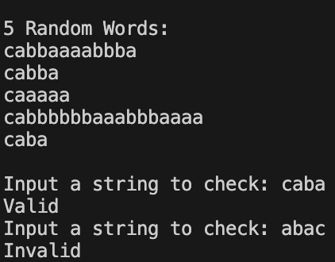

# Lab 1: Regular Grammars

### Course: Formal Languages & Finite Automata
### Author: Nejintev Nicolai

----

## Theory

A grammar may be represented as a 4-tuple
* $V_N$ – Set of non-terminal symbols
* $V_T$ – Set of terminal symbols
* $S$ – Start symbol
* $P$ – Set of productions

A deterministic finite automaton is a 5-tuple:
* $Q$ – Set of states
* $\Sigma$ – Alphabet
* $\delta$ – Transition function
* $q_0$ – Initial state
* $F$ – Set of accepting (final) states

To create a DFA from a Regular Grammar these rules may be applied:
* $Q = V_N \cup \{q_{final}\}$
  
  (The states are all non-terminals and an additional final state)
* $\Sigma = V_T$

  (The alphabet is all terminals)
* $q_0 = S$

  (The starting state of the DFA is the starting symbol of the grammar)
* $F = \{q_{final}\}$

  (The added final state is the only accepting one)
* For each production in form of $A\rightarrow{}bC$, add the transition rule $A\xrightarrow{b}C$
* For each production in form of $A\rightarrow{}b$, add the transition rule $A\xrightarrow{b}q_{final}$

To check if a string is valid in the given regular grammar:
* Set the DFA to the start state $S$
* Read the string sequentially, and treat each character as a transition
  * Read left-to-right for right-regular grammar
  * Read right-to-left for left-regular grammar
* If all transitions exist, and after reading the string the DFA is in an accepting state – the string is valid
## Objectives:

* Implement Grammar class
* For the Grammar, add a method that generates 5 valid strings from the language expressed by the given grammar
* Convert an object of type Grammar to one of type Finite Automaton
* For the Finite Automaton, add a method that checks if an input string can be obtained via the state transition from it


## Implementation description

### Grammar
I've created a class that holds the properties of a regular grammar. The constructor checks the validity and the left/rightness of the grammar. The `generateWord` method starts with the Start Symbol, chooses a non-terminal, and replaces it with a random production. This is repeated until the sting contains only terminals. 

### DFA
The DFA class works in a similar manner. The constructor checks the validity. The `isValid` method sets the state to the Start State, and then scans the string character by character. Each character is treated as a transition, and changes the state. If all the transitions exist, and after the string is scanned, the state is one of the final states, then the string is a valid word.

### Conversion
To convert a grammar into a DFA, I used the rules outlined in the theory. 

### Execution

* Install `node.js` and `npm` 
* Install the dependencies 
  ```sh
  npm install
  ```
* Run the project
  ```sh
  npm run start
  ```

## Conclusion 
After finishing this laboratory work, it is evident that implementing basic regular grammar and deterministic finite automata is not that hard. However, it is very constrained. Implementing even extended regular automata could prove much harder. The implementation I've ended up with can validate the input grammar, with expressive errors; it works with right and left regular grammars, and can transform them into DFAs.

### Screenshot


## References
1. [Transforming Regular Grammars to Equivalent Finite State Automata](http://www.cs.um.edu.mt/gordon.pace/Research/Software/Relic/Transformations/RG/toFSA.html)