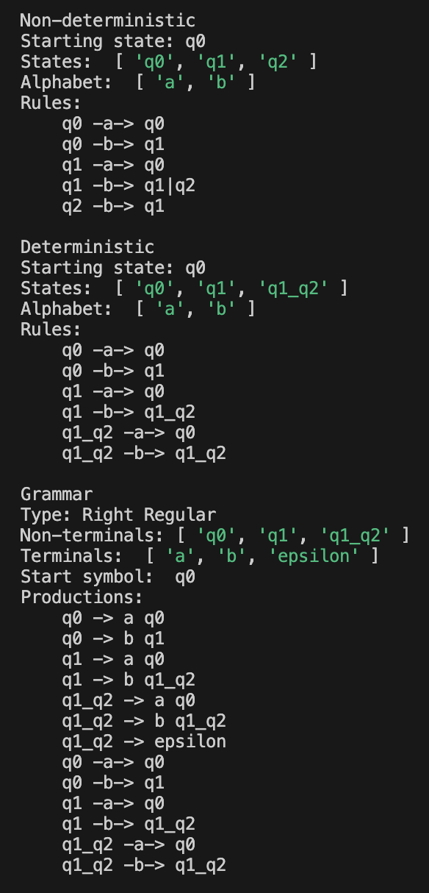
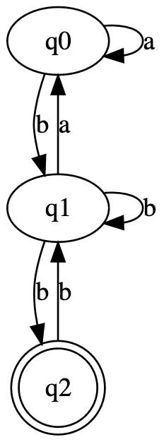
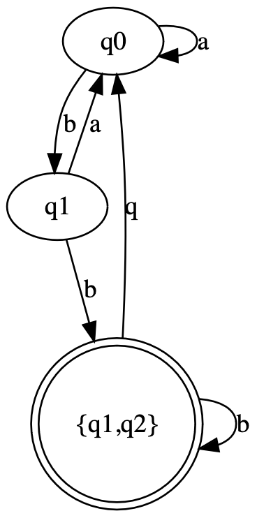

# Lab 2: NFA to DFA conversion

### Course: Formal Languages & Finite Automata
### Author: Nejintev Nicolai

----

<br>

## Objectives

1. Provide a function in your grammar type/class that could classify the grammar based on Chomsky hierarchy.
2. For this you can use the variant from the previous lab.
3. Implement conversion of a finite automaton to a regular grammar.
4. Determine whether your FA is deterministic or non-deterministic.
5. Implement some functionality that would convert an NFA to a DFA.
6. Represent the finite automaton graphically

## Theory
### Chomsky hierarchy
Chomsky grammar types are a classification system for formal grammars, that consists of four levels:
* Type 3: Regular Grammars:
  
  Regular grammars are the simplest. They generate regular languages, which can be recognized by finite automata.
  Regular grammars consist of production rules of the form A → αB or A → α, where A and B are non-terminal symbols, and α is a string of terminal symbols or ε.
* Type 2: Context-free Grammars:

  Context-free grammars consist of production rules of the form A → β, where A is a single non-terminal symbol and β is a string of terminal and/or non-terminal symbols.
* Type 1: Context-sensitive Grammars:
  
  Context-sensitive grammars consist of production rules of the form αAβ → αγβ, where A is a non-terminal symbol, α and β are strings of terminal and/or non-terminal symbols, and γ is a non-empty string.

* Type 0: Unrestricted Grammars:
  
  Unrestricted grammars have no restrictions on the form of production rules.

Determining the Chomsky grammar type of a given formal grammar involves analyzing the structure of its production rules.

#### Type 1 difficulty
Checking that all productions correspond to the αAβ → αγβ form. However there is an easier rule to check. A grammar is type 1 if the left side of the production is never longer than the right side.

### NFA to DFA conversion
To transform an NFA to DFA a simple algorithm is followed;
* Add the NFA start symbol to the new DFA.
* For each state in the DFA and each input symbol, determine the set of states reachable from the current state by following transitions on the NFA, and add the sum of the reachable states as a new state into the DFA. Repeat until no new states are created.
* Every DFA state that contains a NFA final state is considered final itself.

### DFA to Grammar conversion
* Each state of the DFA corresponds to a non-terminal symbol in the grammar.
* For each transition δ(q, a) = p in the DFA, add production rules of the form A → aB.
* Set the initial state of the DFA as the start symbol of the grammar. Add production rules A → ε for each final state A.

## Implementation description

The class FiniteAutomata can now hold non-ε NFAs and Grammar can now contain non-regular grammars.

FiniteAutomata has methods:
* isDeterministic() – Checks wether the automaton is DFA
* toDeterministic() – Returns a corresponding DFA if the automaton is NFA
* toRightRegularGrammar() – Returns a corresponding regular grammar

Grammar gas method:
* getType() – Returns the Chomsky type of the Grammar

## Execution

* Install `node.js` and `npm` 
* Install the dependencies 
  ```sh
  npm install
  ```
* Run the project
  ```sh
  npm run start
  ```

## Conclusion 

### Pictures
#### Screenshot

#### NFA

#### Corresponding DFA

