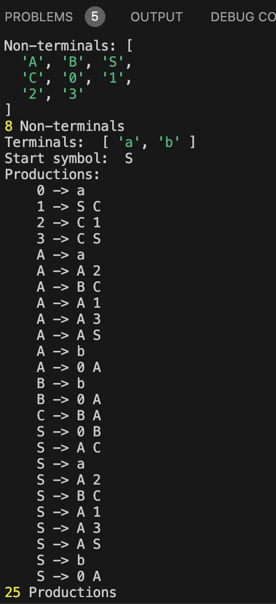

# Lab 5: Chomsky Normal Form

### Course: Formal Languages & Finite Automata
### Author: Nejintev Nicolai

----

<br>

## Objectives

1. Learn about Chomsky Normal Form (CNF) [1].
2. Get familiar with the approaches of normalizing a grammar.
3. Implement a method for normalizing an input grammar by the rules of CNF.
  * The implementation needs to be encapsulated in a method with an appropriate signature (also ideally in an appropriate class/type).
  * The implemented functionality needs executed and tested.
  * A BONUS point will be given for the student who will have unit tests that validate the functionality of the project.
  * Also, another BONUS point would be given if the student will make the aforementioned function to accept any grammar, not only the one from the student's variant.

## Theory

Chomsky Normal Form (CNF) is a way to represent context-free grammars in a
standardized form. In CNF, every production rule in the grammar is of one of two forms:
1. A → BC, where A, B, and C are non-terminal symbols (symbols that can be
replaced with strings of other symbols).
2. A → a, where A is a non-terminal symbol and a is a terminal symbol (a symbol
that cannot be replaced further).
Additionally, the start symbol of the grammar must not appear on the right-hand side of
any production rules except for the rule that defines it.
CNF simplifies the process of analyzing and manipulating grammars, making it easier to
study their properties and design algorithms for processing them. It's named after the
linguist Noam Chomsky, who contributed significantly to the theory of formal languages
and grammars.

## Implementation description

### Epsilon Removal:
  Epsilon productions are rules where a non-terminal can derive an empty string.
  The function iterates through the grammar's rules, identifying epsilon rules and removing them.
  It then iteratively checks and updates other rules to handle the absence of epsilon productions.

### Renaming Removal:
  Renaming rules are those where a non-terminal derives another non-terminal directly.
  The function iterates through the grammar's rules, identifying renaming rules and replacing them with expanded rules.
  It ensures that all instances of the renamed non-terminal are properly replaced.

### Inaccessible Symbols Removal:
  Symbols that are not reachable from the start symbol are removed from the grammar.
  It filters out non-terminals and terminals that are not marked as accessible.

### Non-Productive Symbols Removal:
  Non-terminals that cannot derive any terminal string are removed from the grammar.
  It filters out non-terminals that are not marked as productive.

### Conversion to CNF:
  The grammar is transformed into Chomsky Normal Form (CNF).
  It iterates through the rules, splitting long productions into smaller ones and introducing new non-terminals as necessary to meet the CNF requirements.

## Execution

* Install `node.js` and `npm` 
* Install the dependencies 
  ```sh
  npm install
  ```
* Run the project
  ```sh
  npm run start
  ```

## Example

## Conclusion 

In conclusion, establishing a laboratory focused on creating a code to convert
Context-Free Grammars (CFGs) to Chomsky Normal Form (CNF) offers valuable
insights into the foundational principles of formal languages and grammars. Through
this endeavor, students and researchers gain a deeper understanding of the structure
and transformational properties of grammars, honing their skills in algorithm design,
parsing techniques, and language processing