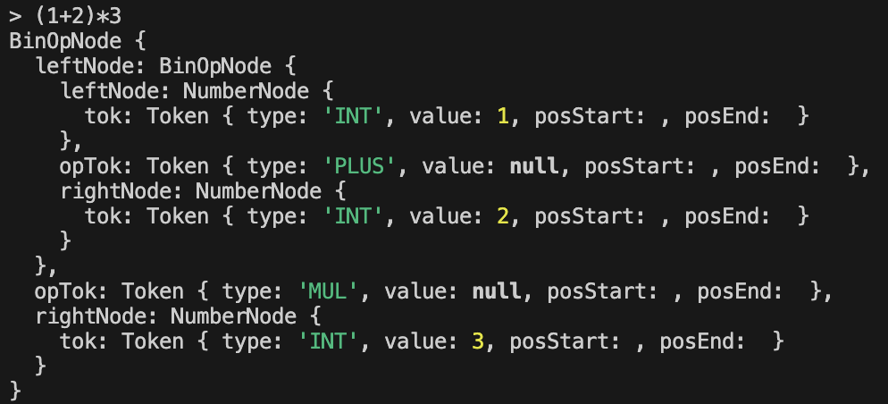

# Lab 6: Abstract Syntax Trees

### Course: Formal Languages & Finite Automata
### Author: Nejintev Nicolai

----

<br>

## Objectives

1. Get familiar with parsing, what it is and how it can be programmed;
2. Get familiar with the concept of AST;
3. In addition to what has been done in the 3rd lab work do the following:
In case you didn't have a type that denotes the possible types of tokens you
need to:
  * Have a type TokenType (like an enum) that can be used in the lexical
analysis to categorize the tokens. Please use regular expressions to identify the type of the token.
  * Implement the necessary data structures for an AST that could be used for
the text you have processed in the 3rd lab work.
  * Implement a simple parser program that could extract the syntactic
information from the input text.

## Theory

Parsing is a fundamental process in computer science and linguistics, serving as the
bridge between raw textual data and structured representations that computers can
understand and manipulate. At its core, parsing involves analyzing the syntactic
structure of a piece of text according to a formal grammar. This process is particularly
crucial in programming languages, where compilers or interpreters must transform
human-readable code into machine-executable instructions.
Parsing typically operates in several stages. First, the input text is tokenized, breaking it
down into fundamental units such as keywords, identifiers, operators, and literals. Next,
these tokens are analyzed according to the grammar rules of the language to determine
their syntactic structure. This phase often involves constructing a parse tree or, more
commonly, an abstract syntax tree (AST), which represents the hierarchical structure of
the parsed code, abstracting away details that are not relevant to its meaning or
execution. Each node in the tree corresponds to a syntactic construct, such as a statement
or an expression, and the edges represent the relationships between these constructs. By
traversing this tree, compilers and interpreters can perform various tasks, such as type
checking, optimization, and code generation. Overall, parsing plays a vital role in
enabling computers to understand and process human-generated textual input, forming
the foundation for many aspects of language processing, including programming
language implementation, natural language processing, and more.

## Execution

* Install `node.js` and `npm` 
* Install the dependencies 
  ```sh
  npm install
  ```
* Run the project
  ```sh
  npm run start
  ```

## Example

## Conclusion 

In conclusion, the laboratory work focused on creating a custom parser has been a
valuable learning experience, offering insights into the intricate process of
transforming raw textual data into structured representations. Throughout the project,
we delved into fundamental concepts of parsing, including lexical analysis, syntactic
analysis, and abstract syntax tree construction.
By implementing our own parser, we gained a deeper understanding of how
programming languages and other formal languages are interpreted and executed by
computers. We explored the role of grammars in defining language syntax, the
importance of tokenization in breaking down input text into meaningful units, and
the process of constructing abstract syntax trees to represent parsed expressions.
Moreover, the laboratory work provided hands-on experience in writing code to
handle various parsing tasks, such as recognizing different types of tokens, handling
operator precedence and associativity, and detecting and reporting syntax errors.
Through iterative development and testing, we honed our problem-solving skills and
gained proficiency in debugging and error handling.